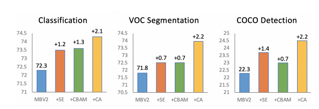

# 涨点模块的对比

对比测试
- [SE](https://github.com/moskomule/senet.pytorch)通道注意力
- [CBAM](https://github.com/luuuyi/CBAM.PyTorch)通道注意+空间注意力
- [Coordinate Attention](https://github.com/Andrew-Qibin/CoordAttention)，个人认为是一种通道注意力+x方向空间+y方向空间注意力机制。其思路很像[Strip Pooling](https://github.com/Andrew-Qibin/SPNet)

## 1. 参数对比
这里采用同样的输入，同样的输入，输出通道，同样的中间过渡通道。统计三个模块的浮点数计算量与参数量。

| Module | macs/flops | params  |
| :----: | :--------: | :-----: |
|   SE   | 40993792.0 | 8192.0  |
|  CBAM  | 56706560.0 | 8290.0  |
|   CA   | 95923200.0 | 12848.0 |

## 2. 效果对比
来自:[https://arxiv.org/pdf/2103.02907.pdf](https://arxiv.org/pdf/2103.02907.pdf)
